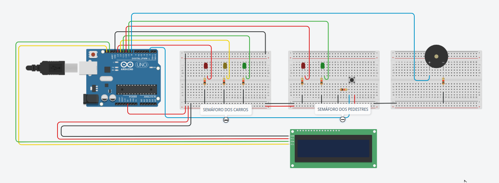
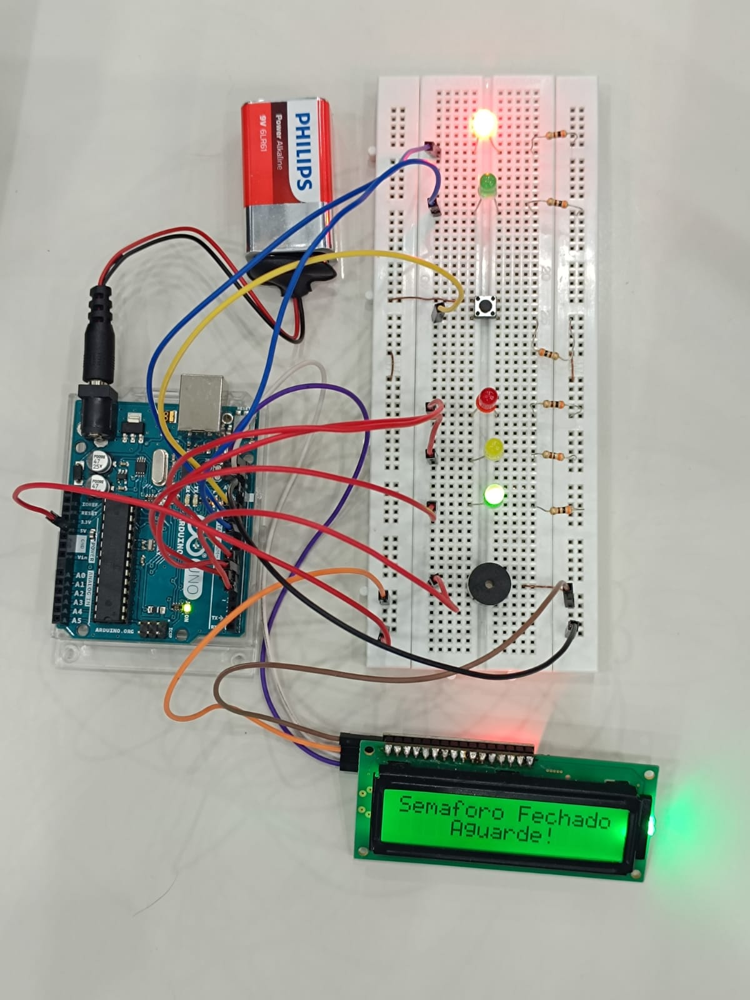

# 🚦 Inclusive Traffic Light with Arduino


---

# 1️⃣ Project Objective

The objective of this project is to demonstrate how embedded systems can be used to **promote social inclusion for People with Disabilities (PwD)**.

The system simulates an **inclusive pedestrian traffic light**, combining visual and auditory signals to assist pedestrians during street crossings.

The project focuses particularly on **accessibility for visually impaired individuals**, using sound alerts and a countdown display to indicate when it is safe to cross.

This prototype was developed as an educational project using an Arduino microcontroller and basic electronic components.

---

# 🧰 Hardware Components

The following components were used to assemble the physical prototype:

* **1 × Arduino Uno**
* **1 × Breadboard**
* **2 × Green LEDs**
* **2 × Red LEDs**
* **1 × Yellow LED**
* **1 × 5V Buzzer**
* **1 × Push Button (Tactile Switch)**
* **5 × 220Ω Resistors** (for the LEDs)
* **1 × 10kΩ Resistor** (pull-down resistor for the button)
* **Jumper wires**
* **Copper wires** *(optional)*
* **1 × 9V Battery** *(optional – for standalone power supply)*
* **1 × 9V Battery Clip with P4 Connector** *(optional)*

---

# ⚙️ Code Operation Overview

The program controls the behavior of the traffic light system and simulates the interaction between vehicles and pedestrians.

### Initial State

When the system starts:

* The **car traffic light is green**
* The **pedestrian traffic light is red**
* The LCD displays a message instructing pedestrians to wait.

### Pedestrian Request

When the pedestrian presses the button:

1. The system verifies whether enough time has passed since the last activation.
2. This prevents multiple triggers caused by button noise (simple debounce).
3. The car traffic light transitions from **green → yellow → red**.

### Pedestrian Crossing

Once cars stop:

* The pedestrian signal turns **green**
* The LCD displays a **countdown timer**
* The buzzer emits **auditory signals** to assist visually impaired pedestrians.

During the final seconds of the countdown, the buzzer **increases its frequency**, warning that the crossing time is ending.

### Crossing End

After the countdown finishes:

* The pedestrian signal turns **red**
* A warning message is displayed on the LCD
* The system returns to its **initial state**, allowing cars to move again.

---

# 🔌 Hardware Explanation

## LCD Display (I2C Protocol)

The project uses a **16x2 LCD display with an I2C communication module**.

I2C (Inter-Integrated Circuit) allows the display to communicate with the Arduino using only **two data lines**:

* **SDA (data)**
* **SCL (clock)**

This significantly reduces the number of Arduino pins required compared to traditional parallel LCD connections.

The display is used to show:

* system messages
* pedestrian instructions
* the crossing countdown timer

---

## Buzzer

The **buzzer** provides **auditory feedback** during the pedestrian crossing phase.

It emits sound signals that help visually impaired pedestrians understand when it is safe to cross.

* Slow beeps during the first seconds
* Faster beeps during the final seconds of the countdown

This behavior mimics real accessibility traffic lights used in urban environments.

---

## Push Button and Pull-Down Resistor

The push button allows pedestrians to **request a crossing**.

A **10kΩ pull-down resistor** is connected to the button to ensure that the input pin reads a stable **LOW signal when the button is not pressed**.

Without the resistor, the input could float and produce random readings.

When the button is pressed:

* the signal becomes **HIGH**
* the Arduino detects the request
* the traffic light transition sequence begins

---

# 🖼️ Circuit Simulation

You can interact with the full simulation on Tinkercad:
https://www.tinkercad.com/things/dYOQ8lY5PCG/editel?returnTo=%2Fdashboard&sharecode=SVJqays7W3GRmQuSdGLTX25fhbGQh8EOYEmKcYKkl5c



---

# 🛠️ Physical Prototype



---

# 📂 Repository Structure

```
inclusive-traffic-light/
│
├── inclusive_traffic_light/
│   └── inclusive_traffic_light.ino
│
├── docs/
│   ├── tinkercad_circuit.png
│   └── real_prototype.jpg
│
└── README.md
└── LICENSE
```

---

# 👨‍💻 Authors

Developed by:

- [Gabriel](https://github.com/gabriel-san23)
- [Felipe Nascimento](https://github.com/felipe-27)
- [Daniel](https://github.com/DanielCataneo)
- [Oliver](https://github.com/oliverscarraro)
- [Felipe Dessico]

---

# 📚 References

The following resources were used as references during the development of this project:

* Arduino Documentation – *tone() function*
  https://docs.arduino.cc/language-reference/fun%C3%A7%C3%B5es/advanced-io/tone/

* Arduino Starter Kit Manual
  https://www.als.lib.wi.us/site/wp-content/uploads/2018/05/arduino-starter-kit-manual.pdf

